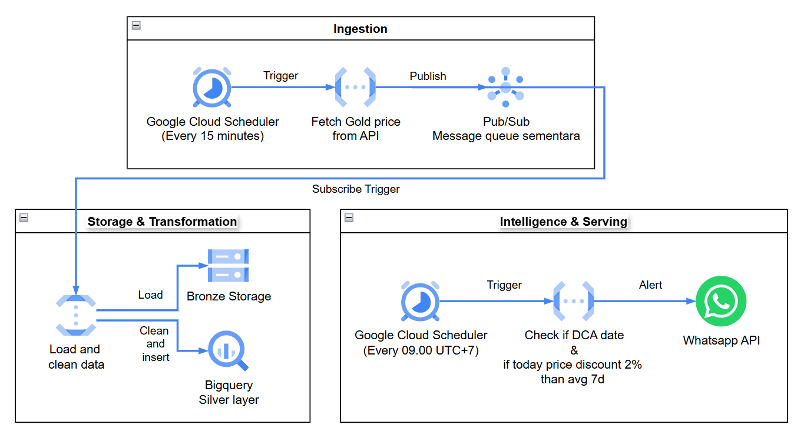

## TECHNICAL DESIGN DOCUMENT

### Project Overview & Goals

Project ini bertujuan untuk mengembangkan sistem otomatis untuk reminder pembelian emas berdasarkan strategi Dollar Cost Averaging (DCA). Sistem ini akan memantau harga emas secara otomatis dan memberikan sinyal ke Slack pengguna ketika:
1. Setiap tanggal 15 setiap bulan
2. Harga saat ini at least lebih kecil 2% dari rata-rata harga mingguan.

Selain itu, karena pipeline data sekaligus menyimpan data harga emas, maka sistem ini juga dapat digunakan untuk keperluan analisis harga emas di masa depan.

---
### Technology Stack
- **Cloud Function**: Untuk menjalankan kode secara otomatis berdasarkan jadwal yang ditentukan.
- **Pub/Sub**: Untuk buffer antar Publisher Cloud Function dan Subscriber Cloud Function yang akan memproses data dan menyimpan ke storage.
- **Cloud Storage**: Untuk menyimpan data mentah (Bronze Layer) dan BigQuery untuk menyimpan data yang sudah diproses (Silver Layer).
- **Cloud Scheduler**: Untuk menjadwalkan eksekusi Cloud Function setiap waktu yang ditentukan.
- **Slack API**: Untuk mengirimkan notifikasi ke channel Slack pengguna ketika kondisi alert terpenuhi.

### Cloud Provider: Google Cloud Platform (GCP)

##### Project Name: gold-price-alert
##### Project ID: gold-price-alert-488703
##### Region: asia-southeast2 (Jakarta)

### System Architecture



---

### Data Schema and Medallion Layering

#### Bronze Layer
```json
{
  "name": "Gold",
  "price": 5172.299805,
  "symbol": "XAU",
  "updatedAt": "2026-02-24T07:01:40Z",
  "updatedAtReadable": "a few seconds ago"
}
```
##### Struktur GCS:

```
gs://bucket-name/bronze/YYYY/MM/HH-mm-ss.json
```

#### Silver Layer
```sql
CREATE OR REPLACE TABLE silver_gold_price AS
SELECT
  name,
  price,
  symbol,
  TIMESTAMP(updatedAt) AS price_date,
FROM bronze_gold_price;
```

```json 
{
  "name": "Gold",
  "price": 5172.299805,
  "symbol": "XAU",
  "updated_at": "2026-02-24T07:01:40Z"
}
```

---

### Alerting Logic
Sistem akan memberikan sinyal beli ketika harga saat ini lebih kecil 2% dari rata-rata harga mingguan. Secara matematis, kondisi untuk alert adalah:

$$Price < (Weekly\_Avg \times 0.98)$$
- Weekly Average diambil dari silver layer 7 hari terakhir
- Jika data < 3 hari tersedia → skip alert (insufficient data)

#### Trigger Conditions
```
IF tanggal == 15:
    kirim Monthly Reminder (apapun harganya)
IF price < weekly_avg * 0.98:
    kirim Price Drop Alert
    (max 1x per hari untuk hindari spam)
```

#### Alert Message Format

- Below Weekly Average:

```
🟡 *GOLD SIGNAL*
━━━━━━━━━━━━━━━━━━
📌 Type    : Price Drop Alert
💰 Price   : $2,915.50 (XAU/USD)
📊 7d Avg  : $2,980.00
📉 Drop    : -2.16%
🕐 Time    : 2026-02-27 09:15 WIB

Sudah saatnya beli emas! Harga saat ini sudah lebih rendah 2% dari rata-rata harga mingguan.
```

- Monthly Reminder (15th of each month):

```
🔔 *GOLD MONTHLY REMINDER*
━━━━━━━━━━━━━━━━━━
📌 Type    : Monthly Reminder
💰 Price   : $2,915.50 (XAU/USD)
🕐 Time    : 2026-02-15 09:00 WIB

Jangan lupa untuk melakukan pembelian emas sesuai strategi DCA! Harga saat ini adalah $2,915.50.
```

### Environment & Configuration
##### GCP Secret Manager:
- `SLACK_WEBHOOK_URL`: URL untuk mengirim notifikasi ke Slack.

##### Environment Variables:
- `GCS_BUCKET_NAME`: Nama bucket GCS untuk menyimpan data.
- `BQ_DATASET_NAME`: Nama dataset BigQuery untuk menyimpan data yang sudah diproses.
- `ALERT_THRESHOLD`: Persentase penurunan harga untuk trigger alert (default: 0.02 untuk 2%).
- `ALERT_COOLDOWN_HOURS`: Durasi cooldown untuk menghindari spam alert (default: 24 jam).

### Project Structure
```
gold-price-data-pipeline/
├── src/
      TBA
├── tests/
      TBA
├── terraform/               # IaC
├── TDD.md
├── pyproject.toml
└── .gitignore
```

### Error Handling & Logging

| Skenario             | Handling                            |
| -------------------- | ----------------------------------- |
| API gagal / timeout  | Retry 3x dengan exponential backoff |
| GCS write gagal      | Log error, tidak trigger alert      |
| Slack webhook gagal  | Log error (jangan crash GCF)        |
| Data silver < 3 hari | Skip price-drop alert, log warning  |

### Cost Estimation
- Estimasi eksekusi per bulan adalah sekitar: 
$(4 \text{ kali per jam} \times 24 \text{ jam} \times 30 \text{ hari}) = 2.880$ eksekusi per Cloud Function. 
- Jumlah ini masih jauh di bawah batas Free Tier GCP
- Total cost = $0
---


